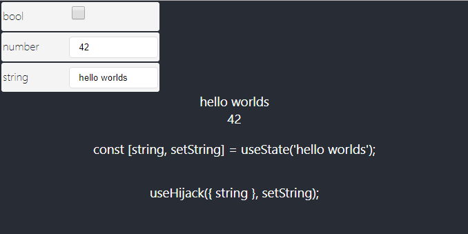

Easy state debugging hook.



# Example

```javascript
import { Hijack, useHijack } from "use-hijack";

const Foo = () => {
    const [string, setString] = useState("hello worlds");
    const [number, setNumber] = useState(42);

    useHijack({ string }, setString);
    useHijack({ number }, setNumber);

    return (
        <div>
            <div>{string}</div>
            <div>{number}</div>
        </div>
    );
};

/* ... */

const App = () => {
    return (
        <Hijack>
            <Foo />
        </Hijack>
    );
};
```
